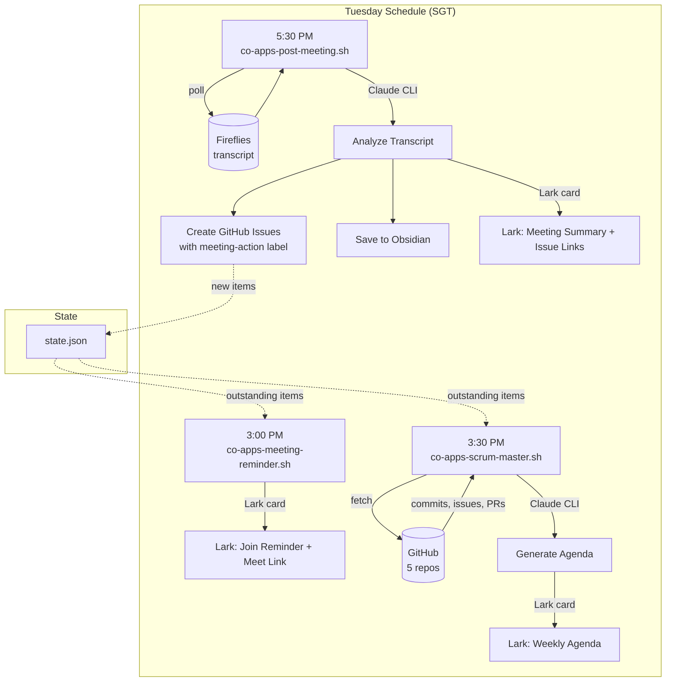

# CO Apps Weekly Meeting Automation

## Objective

Automate pre-meeting agenda generation, meeting reminders, and post-meeting action item tracking for the CO Apps team meeting (Tuesdays 4-5 PM SGT).

## Architecture



## Schedule

| Time (SGT) | Script | Purpose |
|------------|--------|---------|
| 3:00 PM Tue | `co-apps-meeting-reminder.sh` | Join reminder + Google Meet link |
| 3:30 PM Tue | `co-apps-scrum-master.sh` | GitHub-sourced weekly agenda |
| 5:30 PM Tue | `co-apps-post-meeting.sh --poll` | Transcript analysis + issue creation |

## GitHub Repos Tracked

| Repo | Primary Contributor | Focus |
|------|-------------------|-------|
| hourhive-buddy | Jilian Garette (@jiliangarette) | VA analytics, Discord/Slack integrations |
| catalyst-opus | Warren Apit (@warren-apit) | Task management platform |
| outsource-sales-portal-magic | gpt-engineer-app[bot] | Sales portal, email notifications |
| catalyst-refresh-glow | gpt-engineer-app[bot] | Marketing website |
| partner-hub-40 | gpt-engineer-app[bot] | Partner hub |

## How Action Items Work

1. Post-meeting script extracts action items from Fireflies transcript via Claude CLI
2. Each item becomes a GitHub issue with `meeting-action` label on the relevant repo
3. Issues are auto-assigned if contributor has a known GitHub username
4. Pre-meeting script checks which items are still open via `state.json`
5. Outstanding items appear in next week's agenda under **Outstanding Action Items**
6. A human reviews the issues and can dispatch an agent to fix them

## Inputs

- `LARK_CO_APPS_WEBHOOK` in `.env` -- Lark webhook for the CO Apps meeting bot
- `FIREFLIES_API_KEY` in `.env` -- Fireflies API key for transcript fetching
- GitHub CLI (`gh`) authenticated with access to all 5 repos

## Outputs

- Lark cards: reminder (purple), agenda (purple), summary (green)
- GitHub issues with `meeting-action` label
- Obsidian notes at `~/Documents/Obsidian Vault/Meetings/CO Apps/`
- State tracking at `~/.local/share/co-apps-meeting/state.json`

## Manual Operations

```bash
# Run scrum master early (generates agenda now)
~/.local/bin/co-apps-scrum-master.sh

# Force post-meeting analysis (skip polling for transcript)
~/.local/bin/co-apps-post-meeting.sh --now

# Run reminder manually
~/.local/bin/co-apps-meeting-reminder.sh

# Check state
cat ~/.local/share/co-apps-meeting/state.json | python3 -m json.tool

# Check open meeting-action issues across all repos
gh search issues --label meeting-action --state open --owner leotansingapore
```

## launchd Agents

| Plist | Schedule |
|-------|----------|
| `com.leo.co-apps-reminder.plist` | Tue 3:00 PM |
| `com.leo.co-apps-scrum-master.plist` | Tue 3:30 PM |
| `com.leo.co-apps-post-meeting.plist` | Tue 5:30 PM |

Load/unload:
```bash
launchctl load ~/Library/LaunchAgents/com.leo.co-apps-reminder.plist
launchctl load ~/Library/LaunchAgents/com.leo.co-apps-scrum-master.plist
launchctl load ~/Library/LaunchAgents/com.leo.co-apps-post-meeting.plist
```

## Troubleshooting

- **Logs:** `~/.local/log/co-apps-meeting.log`
- **Fireflies transcript not found:** Wait for Fireflies to finish processing (30-120 min), then run `co-apps-post-meeting.sh --now`
- **Lark card not sent:** Verify `LARK_CO_APPS_WEBHOOK` in `.env` and test with `curl -X POST "$LARK_CO_APPS_WEBHOOK" -H "Content-Type: application/json" -d '{"msg_type":"text","content":{"text":"test"}}'`
- **GitHub issues not created:** Ensure `gh auth status` shows correct account with repo access
- **Claude CLI fails:** Verify `claude --version` works and Max subscription is active

## Edge Cases

- If no commits in any repo during the week, scrum master still runs and flags all repos as stale
- If Fireflies transcript doesn't appear within 1 hour of polling (6 retries x 10 min), the script exits silently -- run manually later with `--now`
- If the meeting title doesn't contain "CO Apps", the script falls back to matching Tuesday 3:30-5:30 PM SGT time window
- Duplicate processing prevented via `processed_transcripts` array in `state.json`
