# Catalyst Opus — HourHive Buddy Integration Guide

> **What is this?** Catalyst Opus is the **identity provider and API gateway** for HourHive Buddy. This document explains what we serve, what endpoints we expose, and how the SSO flow works — all from the Catalyst Opus perspective.

> **Who is this for?** Junior developers joining the project who need to understand how these two apps connect. Every concept is explained with analogies and diagrams.

> **Looking for HourHive's perspective?** See `docs/catalyst-opus-integration.md` in the [hourhive-buddy](https://github.com/leotansingapore/hourhive-buddy) repo for how HourHive *consumes* these services.

---

## Table of Contents

1. [The Big Picture — Two Apps, One Identity](#1-the-big-picture--two-apps-one-identity)
2. [Glossary](#2-glossary)
3. [Architecture Overview — What Catalyst Opus Serves](#3-architecture-overview--what-catalyst-opus-serves)
4. [The OAuth 2.0 SSO Flow — Step by Step](#4-the-oauth-20-sso-flow--step-by-step)
5. [The Consent Page — How Auto-Approval Works](#5-the-consent-page--how-auto-approval-works)
6. [Token Lifecycle — From Issuance to Expiry](#6-token-lifecycle--from-issuance-to-expiry)
7. [The API Gateway — What Data HourHive Can Access](#7-the-api-gateway--what-data-hourhive-can-access)
8. [Scopes — What Permissions HourHive Requests](#8-scopes--what-permissions-hourhive-requests)
9. [Data Ownership — Who Is Source of Truth](#9-data-ownership--who-is-source-of-truth)
10. [Security Architecture — How Secrets Stay Secret](#10-security-architecture--how-secrets-stay-secret)
11. [The SSO Client Library — Reusable Integration Kit](#11-the-sso-client-library--reusable-integration-kit)
12. [Troubleshooting — Common Issues and Fixes](#12-troubleshooting--common-issues-and-fixes)
13. [Appendix A: OAuth Database ER Diagram](#13-appendix-a-oauth-database-er-diagram)
14. [Appendix B: All OAuth Server Endpoints](#14-appendix-b-all-oauth-server-endpoints)

---

## 1. The Big Picture — Two Apps, One Identity

Think of **Catalyst Opus** as the company headquarters — it knows who everyone is (identity), what they do (roles), and who they work with (assignments). **HourHive Buddy** is the time clock — it tracks hours, generates reports, and handles invoicing.

Users authenticate **once** on Catalyst Opus, then seamlessly access HourHive without entering credentials again. This is called **Single Sign-On (SSO)**.

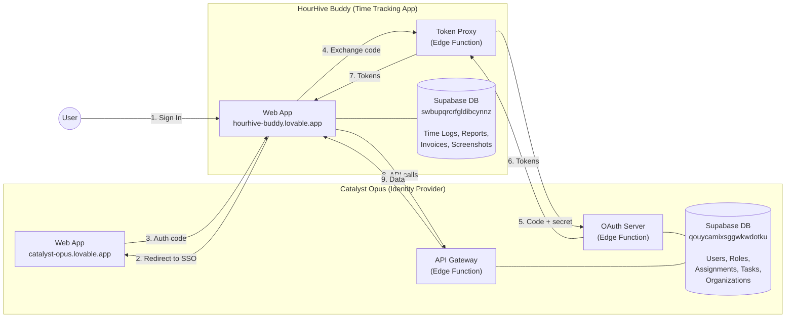

> **Key insight:** Think of it like a corporate badge system. Catalyst Opus issues the badge (identity + role). HourHive reads the badge at the door (validates the token) but manages its own timesheets independently.

---

## 2. Glossary

| Term | Definition |
|------|-----------|
| **OAuth 2.0** | An authorization framework that lets HourHive access user data on Catalyst Opus *without ever seeing the user's password* |
| **PKCE** | "Proof Key for Code Exchange" (pronounced "pixy") — a security extension that prevents authorization code interception. HourHive generates a random secret (`code_verifier`), sends a hash of it (`code_challenge`) with the auth request, then proves it knows the original during token exchange |
| **Authorization Code** | A short-lived (10 minute), single-use code that HourHive exchanges for real tokens. Marked as "used" immediately after exchange |
| **Access Token** | An opaque hex string (not a JWT) that HourHive sends with every API request. Valid for 1 hour (web) or 8 hours (desktop) |
| **Refresh Token** | A long-lived token (30 days web, 90 days desktop) used to get a new access token without re-authenticating the user. Rotated on every use |
| **ID Token** | A JWT containing user claims (id, email, name, roles). Best-effort — the `user` object in the token response is always present as a fallback |
| **Confidential Client** | An OAuth client that has a server-side secret. HourHive is a confidential client — its secret is stored in a Supabase edge function, never exposed to the browser |
| **Token Proxy** | HourHive's `oauth-token-proxy` edge function that injects the client secret server-side during token exchange. The browser never sees the secret |
| **Scope** | A permission string (e.g., `tasks:read`) that limits what HourHive can access. Scopes are granted at authorization time and checked on every API call |
| **Auto-approval** | When a known first-party client requests authorization for a logged-in user, Catalyst Opus skips the consent screen and immediately issues an authorization code |
| **`oauth_clients` table** | The Catalyst Opus database table that stores registered OAuth client applications (like HourHive), their secrets, allowed scopes, and configuration |

---

## 3. Architecture Overview — What Catalyst Opus Serves

Catalyst Opus exposes **three surfaces** to HourHive:

1. **The Consent Page** — A React route where users authenticate
2. **The OAuth Server** — An edge function that handles token exchange, refresh, and user info
3. **The API Gateway** — An edge function that serves protected data (tasks, clients, VAs, etc.)

### Deployed URLs

| Component | URL | Purpose |
|-----------|-----|---------|
| SSO Origin | `https://catalyst-opus.lovable.app` | Consent page (React route) |
| Preview SSO | `https://preview--catalyst-opus.lovable.app` | Preview consent page |
| OAuth Server | `https://qouycamixsggwkwdotku.supabase.co/functions/v1/oauth-server/*` | Token exchange, userinfo, logout |
| API Gateway | `https://qouycamixsggwkwdotku.supabase.co/functions/v1/api-gateway/*` | Protected data API |
| HourHive App | `https://preview--hourhive-buddy.lovable.app` | The consuming app |

### Key Files in Catalyst Opus

| File | What It Does |
|------|-------------|
| `supabase/functions/oauth-server/index.ts` | Complete OAuth 2.0 server — authorize, token, userinfo, logout, revoke, introspect, client registration (~1800 lines) |
| `supabase/functions/api-gateway/index.ts` | REST API gateway — validates OAuth tokens, serves data resources with scope+role filtering (~1200 lines) |
| `src/pages/oauth/Consent.tsx` | Auto-approval consent page with early authorization optimization |
| `src/pages/oauth/LogoutSuccess.tsx` | Post-logout landing page |
| `src/lib/sso-client/` | Reusable SSO client library (PKCE flow, React hooks, token refresh) — copied into HourHive |
| `src/pages/settings/ConnectedApps.tsx` | User-facing "Connected Apps" settings to manage OAuth consents |
| `src/pages/settings/Developers.tsx` | Developer settings for OAuth client management |

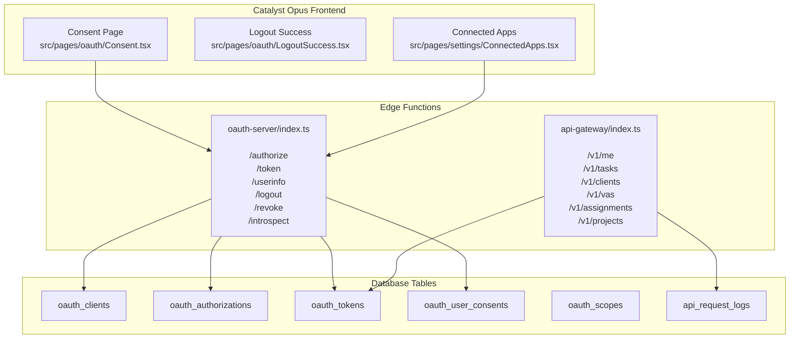

> **Key insight:** Two separate edge functions serve two different purposes. The **OAuth Server** handles *authentication* (who are you?). The **API Gateway** handles *authorization* (what can you access?).

---

## 4. The OAuth 2.0 SSO Flow — Step by Step

Here's the complete login flow, showing exactly what Catalyst Opus does at each step.

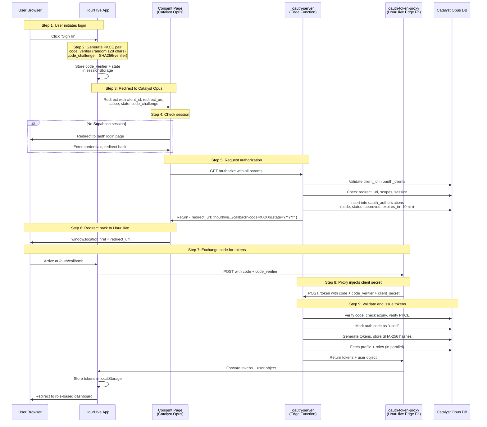

### What happens at each step

| Step | Who runs it | What happens | File |
|------|------------|-------------|------|
| 1-2 | HourHive | Generates PKCE pair, stores in sessionStorage | `hourhive-buddy/src/lib/sso-client/pkce.ts` |
| 3 | HourHive | Builds authorization URL, redirects browser | `hourhive-buddy/src/lib/sso-client/oauth-client.ts` |
| 4 | Catalyst Opus | Checks for cached Supabase session | `src/pages/oauth/Consent.tsx` |
| 5 | Catalyst Opus | Validates client, scopes, PKCE, generates auth code | `supabase/functions/oauth-server/index.ts` (line ~280) |
| 6 | Catalyst Opus | Redirects to HourHive callback URL | `src/pages/oauth/Consent.tsx` |
| 7 | HourHive | Callback page extracts code from URL params | `hourhive-buddy/src/pages/auth/Callback.tsx` |
| 8 | HourHive | Token proxy adds client_secret to request | `hourhive-buddy/supabase/functions/oauth-token-proxy/index.ts` |
| 9 | Catalyst Opus | Validates code, PKCE, issues tokens, stores hashes | `supabase/functions/oauth-server/index.ts` (line ~700) |

> **Key insight:** The authorization code lives for only **10 minutes** and can only be used **once**. After token exchange, it is marked as "used" in the database. This prevents replay attacks.

### Early Authorization Optimization

The consent page (`Consent.tsx`) includes a performance optimization that saves 200-400ms on login:

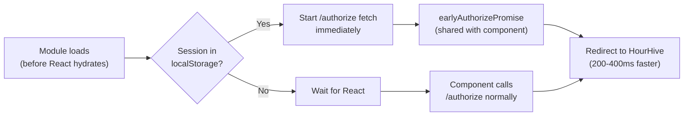

This works because `Consent.tsx` runs a module-level `fetch()` *before React even starts rendering*. The React component then reuses the already-in-flight promise instead of making a duplicate request.

---

## 5. The Consent Page — How Auto-Approval Works

For first-party apps like HourHive, the consent page auto-approves without showing a consent screen. Here's the decision tree:

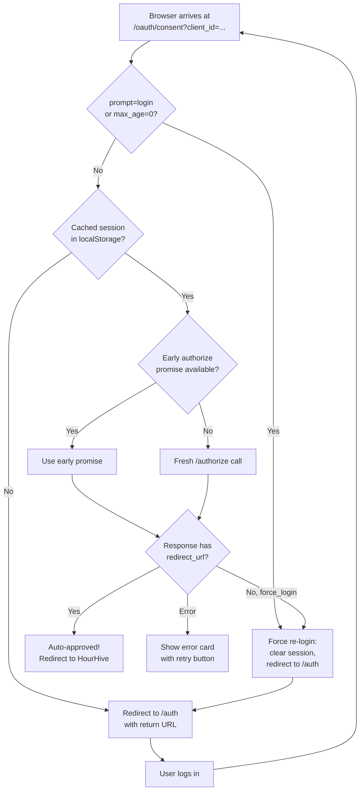

### What `/authorize` validates

When Catalyst Opus receives an authorization request, the OAuth server checks:

1. **`client_id`** exists in `oauth_clients` table and `is_active = true`
2. **`redirect_uri`** matches an allowed URI (with pattern matching for first-party clients)
3. **`response_type`** is `code`
4. **`code_challenge`** is present (required for PKCE flow)
5. **Requested scopes** are all within the client's `allowed_scopes`
6. **User session** is active (valid Supabase auth token)
7. **OIDC params** — `prompt` and `max_age` don't force re-login

### HourHive's OAuth Client Registration

HourHive is registered in the `oauth_clients` table with these key fields:

| Field | Value |
|-------|-------|
| `client_id` | `d2eb9a26c3a60161c4bd32a39e804625` |
| `is_confidential` | `true` (has a server-side secret) |
| `is_first_party` | `true` (auto-approval, flexible redirect URIs) |
| `is_active` | `true` |
| `client_application_type` | `web` (1hr access token, 30 day refresh) |

> **Key insight:** For first-party clients like HourHive, redirect URI validation is flexible — it allows any `*.lovable.app` or `*.lovableproject.com` subdomain as long as the path matches `/auth/callback`. This supports Lovable's preview deployments without registering every preview URL.

---

## 6. Token Lifecycle — From Issuance to Expiry

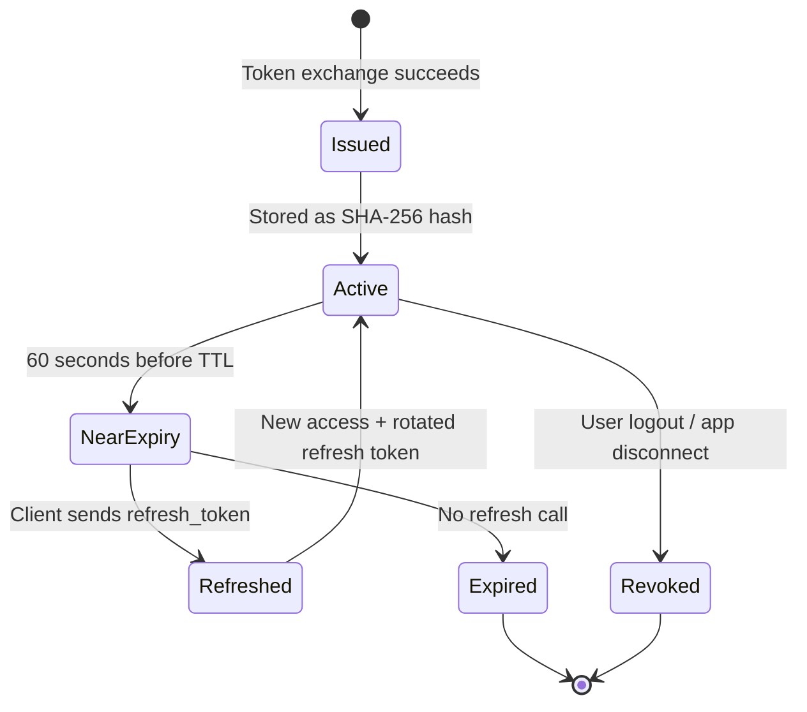

### Token Lifetime Table

| Client Type | Access Token TTL | Refresh Token TTL | When Used |
|-------------|-----------------|-------------------|-----------|
| **Web apps** (default) | 1 hour (3,600s) | 30 days | HourHive browser |
| **Desktop agents** | 8 hours (28,800s) | 90 days | Future desktop apps |
| **Service accounts** | 24 hours (86,400s) | 1 year (365 days) | Machine-to-machine |
| **Per-client override** | Custom | Custom | Set in `oauth_clients` table columns |

### Lifetime Resolution Priority

The function `resolveTokenLifetimes()` in `oauth-server/index.ts` resolves lifetimes in this order:

1. **Client-level override** — `access_token_ttl_seconds` and `refresh_token_ttl_days` columns on `oauth_clients`
2. **Client application type** — `client_application_type` column (`web`, `desktop_agent`, `service`)
3. **Request-time hint** — `token_lifetime_hint` parameter in the token request
4. **Default** — Web app settings (1hr / 30 days)

### Token Response Format

What `/token` returns to HourHive:

```json
{
  "access_token": "a1b2c3d4e5f6...opaque-hex-string",
  "token_type": "Bearer",
  "expires_in": 3600,
  "scope": "openid profile:read email roles tasks:read ...",
  "refresh_token": "f7e8d9c0b1a2...longer-hex-string",
  "refresh_expires_in": 2592000,
  "user": {
    "id": "25f1570f-f55e-4f48-95db-9c995bc7b4d6",
    "name": "John Smith",
    "email": "john@example.com",
    "avatar_url": "https://...",
    "roles": ["client"]
  },
  "id_token": "eyJhbGciOiJIUzI1NiJ9..."
}
```

> **Key insight:** The `user` object is **always** present in the token response, even if ID token generation fails. This is a deliberate design decision — it eliminates the need for HourHive to make a separate `/userinfo` call, saving ~200ms on every login.

### How Token Storage Works

- Tokens are stored as **SHA-256 hashes** in the `oauth_tokens` table — Catalyst Opus never stores raw tokens
- Validation uses the `validate_oauth_token` RPC function (hashes the incoming token and looks up the hash)
- **Refresh token rotation:** on each refresh, the old refresh token is invalidated and a new one is issued. This is a sliding window — the expiry extends on each use.

---

## 7. The API Gateway — What Data HourHive Can Access

After obtaining tokens, HourHive calls the API Gateway to fetch data. Here's how every request flows:

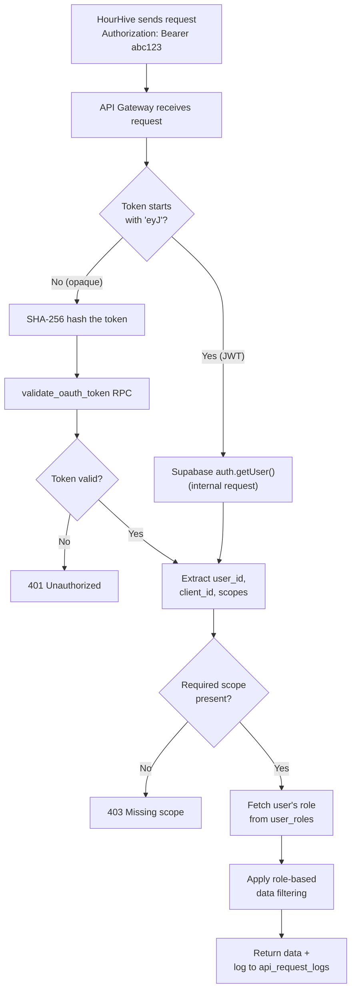

> **Key insight:** The API Gateway supports **dual authentication**. It first tries to validate the token as an OAuth opaque token (for external apps like HourHive). If the token looks like a JWT (starts with `eyJ`), it falls back to Supabase auth validation (for internal Catalyst Opus requests). This means the same gateway serves both external and internal clients.

### Complete API Endpoint Reference

| Method | Path | Required Scope | Returns | Role Filtering |
|--------|------|---------------|---------|----------------|
| GET | `/v1/me` | `profile:read` | Current user profile + roles | None — returns own data |
| GET | `/v1/tasks` | `tasks:read` | User's tasks | Client: `client_id = me`. VA: `va_id = me`. Admin: all |
| POST | `/v1/tasks` | `tasks:write` | Created task | Sets `client_id` to caller |
| GET | `/v1/projects` | `projects:read` | User's projects (owned + member) | Filtered by ownership/membership |
| GET | `/v1/time-logs` | `time_logs:read` | Time log entries | Client: `client_id = me`. VA: `va_id = me` |
| GET | `/v1/messages` | `messages:read` | Direct messages | Filtered to sender/receiver = me |
| GET | `/v1/invoices` | `invoices:read` | Client's invoices | Filtered to `client_id = me` |
| GET | `/v1/clients` | `clients:read` | Client list | Admin: all. VA: assigned only. Client: 403 |
| GET | `/v1/clients/:id` | `clients:read` | Specific client profile | Admin: any. VA: only if assigned. Others: 403 |
| GET | `/v1/vas` | `vas:read` | VA list | Admin: all. Client: assigned only. VA: 403 |
| GET | `/v1/vas/:id` | `vas:read` | Specific VA profile | Admin: any. Client: only if assigned. Others: 403 |
| GET | `/v1/assignments` | `va_assignments:read` | VA-Client assignments (enriched with profiles) | Admin: all. Client: own. VA: own |
| GET | `/v1/assignments/:id` | `va_assignments:read` | Specific assignment with client + VA profiles | Must be admin, client, or VA in the assignment |

### Query Parameters

Most list endpoints support:

| Parameter | Default | Description |
|-----------|---------|-------------|
| `limit` | 50 | Max records to return |
| `offset` | 0 | Pagination offset |
| `status` | — | Filter by status (varies by endpoint) |
| `priority` | — | Filter by priority (tasks only) |
| `skills` | — | Comma-separated skill filter (VAs only) |
| `contact_id` | — | Filter messages to specific contact |

---

## 8. Scopes — What Permissions HourHive Requests

When HourHive redirects to Catalyst Opus for login, it requests these scopes:

| Scope | Category | What It Unlocks |
|-------|----------|----------------|
| `openid` | Identity | ID token generation (JWT with user claims) |
| `profile:read` | Identity | `/userinfo` endpoint, `/v1/me`, user data in token response |
| `email` | Identity | Email address in tokens and userinfo |
| `roles` | Identity | Roles array (`["client"]`, `["virtual_assistant"]`, `["admin"]`) in tokens |
| `offline_access` | Session | Refresh token issuance — enables long-lived sessions |
| `time_logs:read` | Data | GET `/v1/time-logs` |
| `time_logs:write` | Data | Write time log entries |
| `va_assignments:read` | Data | GET `/v1/assignments` — view VA-client relationships |
| `clients:read` | Data | GET `/v1/clients` — view client profiles |
| `vas:read` | Data | GET `/v1/vas` — view VA profiles |
| `tasks:read` | Data | GET `/v1/tasks` — view tasks |
| `invoices:read` | Data | GET `/v1/invoices` — view invoices |
| `projects:read` | Data | GET `/v1/projects` — view projects |
| `projects:write` | Data | POST `/v1/projects` (future) — create projects |
| `organizations:read` | Data | GET `/v1/orgs` (future) — view organizations |

### How Scope Checking Works

The `hasScope()` function in `api-gateway/index.ts`:

1. **Exact match** — `tasks:read` matches `tasks:read`
2. **Write implies read** — `tasks:write` grants access to `tasks:read` endpoints

### Where Scopes Live

| Table | What It Stores |
|-------|---------------|
| `oauth_scopes` | Master list of all available scopes with descriptions |
| `oauth_clients.allowed_scopes` | Which scopes each client is allowed to request |
| `oauth_user_consents.scopes` | Which scopes a user has granted to a specific client |
| `oauth_tokens.scopes` | Which scopes are active on a specific token session |

---

## 9. Data Ownership — Who Is Source of Truth

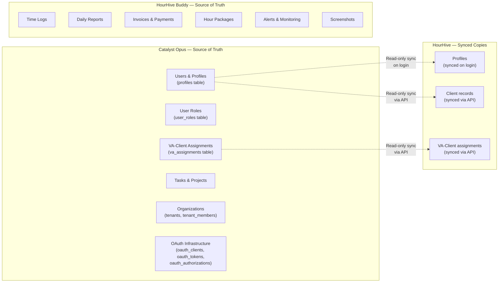

### The Rules

1. **Catalyst Opus is the identity authority.** If you need to know who a user is, what role they have, or who they're assigned to — that answer comes from Catalyst Opus.

2. **HourHive is the time-tracking authority.** Time logs, reports, invoices, and hour packages are created and managed in HourHive's own database.

3. **Sync is one-directional.** Catalyst Opus → HourHive. HourHive never writes user, role, or assignment data back to Catalyst Opus.

4. **Changes propagate on next interaction.** If a VA is assigned to a new client in Catalyst Opus, HourHive discovers it on the next API call or login.

> **Key insight:** HourHive is a *consumer* of Catalyst Opus identity data, not a *producer*. If a VA-client assignment changes, that change happens in Catalyst Opus. HourHive discovers it on the next API call.

---

## 10. Security Architecture — How Secrets Stay Secret

The integration has **seven layers of security**, each protecting against a different threat:

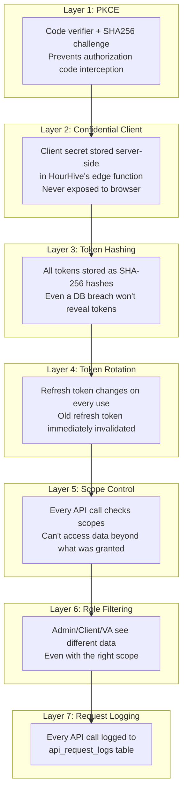

### How the Token Proxy Works

The token proxy prevents the client secret from ever reaching the browser:

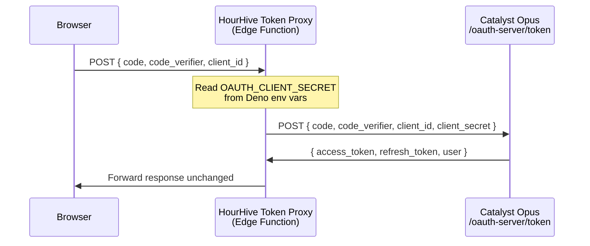

### PKCE Flow Detail

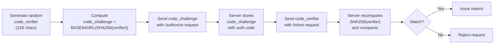

### Redirect URI Validation

| Client Type | Validation Rule |
|-------------|----------------|
| **First-party** (HourHive) | Path must match a registered URI. Host can be any `*.lovable.app`, `*.lovableproject.com`, or `localhost` |
| **Third-party** | Exact full URL match required |

### Cross-Tab Logout

When a user logs out of HourHive:
1. Local tokens are cleared
2. A "logout marker" is set in `localStorage`
3. All other open HourHive tabs detect the marker via `storage` event
4. All tabs clear their auth state and cancel refresh timers
5. Token revocation is sent to Catalyst Opus (fire-and-forget)
6. Hidden iframe cleanup of Catalyst Opus session

---

## 11. The SSO Client Library — Reusable Integration Kit

Catalyst Opus ships a reusable SSO client library at `src/lib/sso-client/`. This library is copied into HourHive (and can be copied into any future app that needs to authenticate against Catalyst Opus).

### File Structure

```
src/lib/sso-client/
├── index.ts              # Main barrel export
├── oauth-client.ts       # SSOClient class — PKCE flow, token refresh, logout
├── types.ts              # TypeScript interfaces (SSOConfig, TokenResponse, StoredTokens, SSOUser)
├── pkce.ts               # PKCE utilities (generateCodeVerifier, generateCodeChallenge)
├── jwt.ts                # JWT decoding (extractUserFromIdToken)
├── storage.ts            # localStorage manager (tokens, PKCE state, logout markers)
├── create-config.ts      # Configuration factory with defaults
├── prewarm.ts            # Edge function pre-warming (eliminates cold starts)
├── react/
│   ├── index.ts          # React barrel export
│   ├── OAuthContext.tsx   # OAuthProvider context
│   ├── OAuthCallback.tsx  # Callback page component
│   └── useOAuth.ts       # Main auth hook
├── README.md             # Quick-start guide
└── SSO-INTEGRATION-GUIDE.md  # Detailed step-by-step guide
```

### Key SSOClient Methods

| Method | What It Does |
|--------|-------------|
| `login(options?)` | Builds authorization URL with PKCE, stores state + verifier, redirects to Catalyst Opus consent page |
| `exchangeCodeForTokens(code, codeVerifier)` | Calls `/token`, stores tokens + user in localStorage |
| `getAccessToken()` | Returns valid access token; auto-refreshes if within 60 seconds of expiry |
| `refreshAccessToken()` | Deduplicates concurrent refresh calls (only one network request even if multiple components call simultaneously) |
| `logout()` | Revokes tokens (fire-and-forget), clears storage, broadcasts to all tabs, redirects to SSO logout |
| `prewarm()` | Sends health check to wake up edge functions, preventing cold-start delays |
| `introspectToken(token)` | Checks if a token is still active server-side |
| `isAuthenticated()` | Returns true if tokens exist and are not expired |
| `getUser()` | Returns cached user object from last token exchange/refresh |

### Performance Optimizations

| Optimization | How It Works | Impact |
|-------------|-------------|--------|
| **Pre-warming** | `prewarm()` hits `/health` on app load | Eliminates 500-1000ms cold start on first auth call |
| **Early authorization** | `Consent.tsx` starts `/authorize` fetch before React hydrates | Saves 200-400ms |
| **Embedded user** | Token response includes `user` object | Eliminates separate `/userinfo` call (~200ms) |
| **Concurrent refresh dedup** | Only one refresh request even if multiple components trigger it | Prevents race conditions and duplicate requests |
| **Fire-and-forget revocation** | Logout doesn't wait for revocation to complete | Instant logout UX |

---

## 12. Troubleshooting — Common Issues and Fixes

### "Invalid authorization code" during token exchange

| | |
|---|---|
| **Symptom** | `/token` returns `{ error: "invalid_grant", error_description: "Invalid authorization code" }` |
| **Cause** | Auth code was used more than once, or expired (10 min TTL) |
| **Check** | Query `oauth_authorizations` table — is status "used" or "expired"? |
| **Fix** | Restart login flow. If happening consistently, check for duplicate exchange calls (early exchange + component exchange racing) |

### User gets auto-logged-in after logout

| | |
|---|---|
| **Symptom** | User logs out but immediately gets a new session when they visit HourHive |
| **Cause** | Catalyst Opus session not fully invalidated before new auth flow starts |
| **Fix** | Ensure `prompt=login` and `max_age=0` on re-login after logout. Check that the logout clears the Supabase session via `supabase.auth.signOut({ scope: 'global' })` |

### "Redirect URI not allowed" error

| | |
|---|---|
| **Symptom** | `/authorize` returns redirect URI error |
| **Cause** | HourHive deployment URL not matching registered URIs or path patterns |
| **Check** | Query `oauth_clients` for HourHive's registered `redirect_uris` |
| **Fix** | For first-party clients, any `*.lovable.app` path match works. For custom domains, add the exact URI to `redirect_uris` array |

### Token refresh fails with "Invalid refresh token"

| | |
|---|---|
| **Symptom** | Refresh returns `{ error: "invalid_grant" }`, user gets logged out |
| **Cause** | Refresh token was already rotated (used), expired, or revoked |
| **Check** | Query `oauth_tokens` table — is `revoked_at` set? Is `refresh_token_expires_at` in the past? |
| **Fix** | This is expected behavior after rotation. Redirect user to re-authenticate. If happening frequently, check for concurrent refresh calls (the dedup logic should prevent this) |

### API Gateway returns 403 "Missing scope"

| | |
|---|---|
| **Symptom** | API call returns `{ error: "Forbidden", message: "Missing scope: tasks:read" }` |
| **Cause** | HourHive requesting an endpoint that requires a scope not included in the original authorization |
| **Check** | Query `oauth_tokens.scopes` for the active token |
| **Fix** | Add the missing scope to HourHive's `sso-config.ts` scopes array AND to `oauth_clients.allowed_scopes` in the database |

### Edge function cold start causing timeout

| | |
|---|---|
| **Symptom** | First request after idle takes 3-5 seconds, occasionally times out |
| **Cause** | Supabase edge function cold start (~500-1000ms) |
| **Fix** | Call `prewarmSSO()` on app load. The SSO client library does this automatically on `SSOClient` construction. Check that `prewarm.ts` is calling `/health` |

### ID token is missing from token response

| | |
|---|---|
| **Symptom** | `id_token` field is `undefined` in token response |
| **Cause** | JWT secret not configured, or ID token generation failed silently |
| **Fix** | Check that `SUPABASE_JWT_SECRET` is set in Supabase edge function secrets. The `user` object is always present as a fallback, so HourHive should use that instead of relying solely on the ID token |

---

## 13. Appendix A: OAuth Database ER Diagram

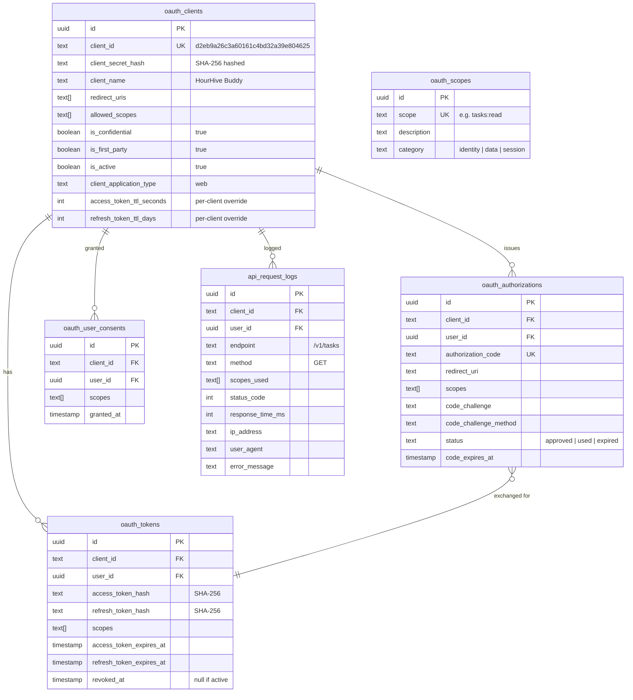

---

## 14. Appendix B: All OAuth Server Endpoints

### Authentication Endpoints

| Method | Path | Purpose | Auth Required |
|--------|------|---------|--------------|
| GET | `/health` | Health check / pre-warm edge function | No |
| GET | `/authorize` | Start authorization flow, issue auth code | Supabase session |
| POST | `/authorize/approve` | User approves consent (manual flow) | Supabase session |
| POST | `/authorize/deny` | User denies consent | Supabase session |
| POST | `/token` | Exchange auth code or refresh token for new tokens | Client credentials or PKCE |

### User Endpoints

| Method | Path | Purpose | Auth Required |
|--------|------|---------|--------------|
| GET | `/userinfo` | Get user profile from access token | OAuth access token |

### Token Management Endpoints

| Method | Path | Purpose | Auth Required |
|--------|------|---------|--------------|
| POST | `/introspect` | Check if a token is still active | OAuth access token |
| POST | `/revoke` | Revoke a single token (access or refresh) | OAuth access token |
| POST | `/revoke-all` | Batch revoke all tokens for a client-user pair | OAuth access token |

### Session Endpoints

| Method | Path | Purpose | Auth Required |
|--------|------|---------|--------------|
| GET/POST | `/logout` | End user session, revoke client tokens, sign out of Supabase | Supabase session or OAuth token |

### Scope Endpoints

| Method | Path | Purpose | Auth Required |
|--------|------|---------|--------------|
| GET | `/scopes` | List all available OAuth scopes | No |

### Client Management Endpoints

| Method | Path | Purpose | Auth Required |
|--------|------|---------|--------------|
| POST | `/clients` | Register a new OAuth client | Admin |
| GET | `/clients` | List all registered OAuth clients | Admin |

### Consent Management Endpoints

| Method | Path | Purpose | Auth Required |
|--------|------|---------|--------------|
| GET | `/consents` | List user's connected apps with granted scopes | Supabase session |
| DELETE | `/consents/:client_id` | Revoke app access and delete all tokens | Supabase session |

---

*Last updated: 2026-03-10 — Documents the OAuth 2.0 SSO integration between Catalyst Opus (identity provider) and HourHive Buddy (time tracking app).*
